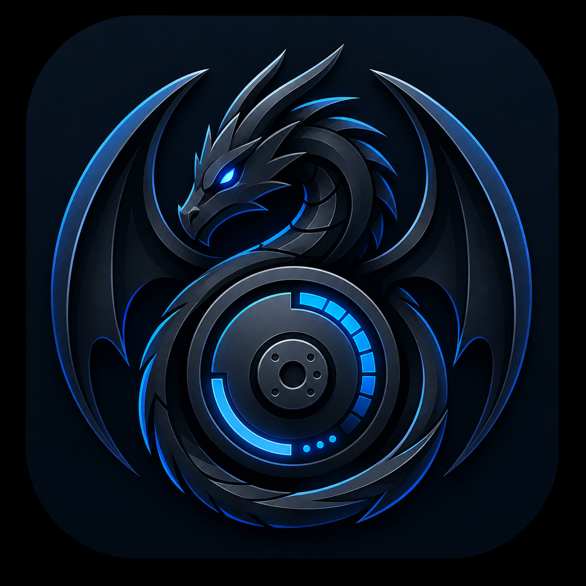

# 🔍 DiskLens (Linux & Cross-Platform Desktop)

<p align="center">
  
</p>

<p align="center">
  <strong>A high-performance, visual disk space analyzer, storage explorer, and duplicate file cleaner for Linux and modern operating systems.</strong>
</p>

<p align="center">
  <a href="#-key-features">Features</a> •
  <a href="#-architecture--tech-stack">Architecture</a> •
  <a href="#-prerequisites--system-dependencies">Prerequisites</a> •
  <a href="#-quick-start--development">Quick Start</a> •
  <a href="#-building-native-binaries--packages">Building & Packaging</a> •
  <a href="#-troubleshooting--faq">Troubleshooting</a>
</p>

---

## 🌟 Overview

**DiskLens** is an open-source, ultra-fast storage analysis suite engineered to provide interactive visual breakdowns of disk consumption. Built with a **Rust (Tauri v2)** core engine and an **interactive React 19 / Vite / Tailwind / D3** user interface, DiskLens lets you pinpoint disk hogs, identify byte-identical duplicate files, safely clean system caches, and monitor filesystem metrics in real time.

---

## ✨ Key Features

### 1. 📊 Interactive Visualizations
- **Hierarchical Sunburst Charts**: Multi-level radial partition diagrams built with D3.js allowing seamless zoom, drill-down, and slice isolation.
- **Squarified Treemaps**: Dynamic nested bounding boxes proportional to size for instant visual discovery of large files and folders.
- **Visual Breadcrumbs & Zoom**: Click into any folder level to recalculate and zoom into local directory allocations with smooth transitions.

### 2. ⚡ High-Throughput Native Scanner
- **Multi-Threaded Parallel Traversal**: Leverages Rust's `rayon` and `walkdir` to scan hundreds of thousands of files across standard Linux ext4, btrfs, xfs, ZFS, and mounted external drives in seconds.
- **Live Scanning Telemetry**: Real-time progress indicators displaying current file paths, throughput speed, and scanned count.

### 3. 👯 Deep Duplicate Finder
- **Two-Pass Heuristic Hashing**:
  1. *Fast Size Bucket*: Pre-filters candidate groups matching exact byte lengths.
  2. *Cryptographic Verification*: Computes streaming SHA-256 hashes to guarantee 100% duplicate accuracy without false positives.
- **Smart Auto-Select Strategies**:
  - Keep newest / keep oldest file.
  - Keep shortest directory path.
  - Custom multi-file selection with bulk move-to-trash support.

### 4. 🧹 Large File Hunter & Smart Cleaner
- **Threshold-Based Filtering**: Search and filter by file size (e.g. `> 100 MB`, `> 1 GB`, `> 5 GB`), category (Videos, Archives, ISOs, Virtual Disks, Code), or modified dates.
- **System Cache & Temp Cleaners**: Guided cleanup for package manager caches (`apt`, `pacman`, `dnf`), browser cache, thumbnail caches, and crash logs.
- **Safe Trashing**: Integrates with standard FreeDesktop Trash (`trash-cli` / `gio trash` specs via Rust `trash` crate) to prevent accidental permanent data loss.

### 5. 💽 Drive & Partition Monitor
- Auto-detects mounted filesystems, external USB drives, and NVMe/SATA partitions with usage meters (`sysinfo` integration).

---

## 🏗 Architecture & Tech Stack

```
DiskLens/
├── assets/                  # High-resolution master assets (Icon.png)
├── public/                  # Static assets & web favicons
├── scripts/                 # Build scripts & icon generator
│   └── generate-tauri-icons.cjs
├── src/                     # Frontend Application (React 19 + TypeScript)
│   ├── assets/              # In-app bundled icons & images
│   ├── components/          # Reusable UI components & modals
│   │   ├── analyzer/        # Sunburst, Treemap, List views
│   │   ├── duplicates/      # Duplicate scanner & selection tools
│   │   ├── cleaner/         # Cache cleaning & large file tables
│   │   ├── layout/          # Sidebar, Header, Navigation
│   │   └── common/          # Modals, tooltips, buttons
│   ├── store/               # Zustand state stores (scanStore, appStore, settingsStore)
│   ├── types/               # Full TypeScript interface definitions
│   ├── App.tsx              # Main orchestrator
│   └── main.tsx             # React DOM entrypoint
├── src-tauri/               # Backend Native Core (Rust + Tauri v2)
│   ├── src/
│   │   └── main.rs          # Rust Tauri commands (scan, hash, trash, sysinfo)
│   ├── icons/               # Multi-platform generated icons (PNG, ICO, ICNS)
│   ├── tauri.conf.json      # Window, bundle & security configurations
│   └── Cargo.toml           # Rust dependencies & metadata
└── package.json             # NPM scripts & dependencies
```

- **Frontend**: React 19, TypeScript, Tailwind CSS v4, Motion, Lucide Icons, D3.js, Recharts, Zustand.
- **Backend / Desktop**: Tauri v2, Rust (2021 Edition), Rayon, WalkDir, SHA-2, Sysinfo, Trash.

---

## 📋 Prerequisites & System Dependencies

### Linux (Arch Linux / Manjaro / EndeavourOS)
```bash
sudo pacman -Syu --needed \
  base-devel \
  curl \
  wget \
  file \
  openssl \
  gtk3 \
  webkit2gtk-4.1 \
  libayatana-appindicator \
  imagemagick \
  ffmpeg \
  nodejs \
  npm \
  rust \
  cargo
```

### Linux (Ubuntu / Debian / Linux Mint / Pop!_OS)
```bash
sudo apt update && sudo apt install -y \
  build-essential \
  curl \
  wget \
  file \
  libssl-dev \
  libgtk-3-dev \
  libwebkit2gtk-4.1-dev \
  libayatana-appindicator3-dev \
  librsvg2-dev \
  imagemagick \
  ffmpeg \
  nodejs \
  npm
```
*Note: Ensure Rust is installed via `curl --proto '=https' --tlsv1.2 -sSf https://sh.rustup.rs | sh`.*

### Linux (Fedora / RHEL)
```bash
sudo dnf install \
  @development-tools \
  curl \
  wget \
  openssl-devel \
  gtk3-devel \
  webkit2gtk4.1-devel \
  libayatana-appindicator-gtk3-devel \
  ImageMagick \
  ffmpeg \
  nodejs \
  npm \
  rust \
  cargo
```

---

## 🚀 Quick Start & Development

### 1. Clone & Install Dependencies
```bash
git clone https://github.com/disklens/disklens.git
cd disklens
npm install
```

### 2. (Optional) Regenerate App Icons
If you customize `assets/Icon.png`:
```bash
npm run generate:icons
```

### 3. Run in Web Development Mode
Launches the full-stack Vite development server at `http://localhost:3000`:
```bash
npm run dev
```

### 4. Run Desktop Application (Live Reload)
Launches the Tauri native desktop window attached to the dev server:
```bash
npm run tauri:dev
```

---

## 📦 Building Native Binaries & Packages

### 🛠 1. Standard Production Build (Auto-Detect Format)
Builds optimized binaries for your current host architecture:
```bash
npm run tauri:build
```
The output will be placed in `src-tauri/target/release/`.

---

### 📦 2. Build Linux `.deb` Package
Builds a standalone Debian/Ubuntu `.deb` installer with desktop entry and menu icons:
```bash
npm run build:deb
```
- **Output Path**: `src-tauri/target/release/bundle/deb/disklens_0.1.0_amd64.deb`
- **Installation on target system**:
  ```bash
  sudo dpkg -i src-tauri/target/release/bundle/deb/disklens_0.1.0_amd64.deb
  # If missing dependencies:
  sudo apt-get install -f
  ```

---

### 📦 3. Build Linux `AppImage`
To bundle a universal portable binary:
```bash
npx tauri build --bundles appimage
```
- **Output Path**: `src-tauri/target/release/bundle/appimage/disklens_0.1.0_amd64.AppImage`
- **Running**:
  ```bash
  chmod +x disklens_0.1.0_amd64.AppImage
  ./disklens_0.1.0_amd64.AppImage
  ```

---

## 🛠 Available Scripts

| Command | Description |
| :--- | :--- |
| `npm run dev` | Starts the Express + Vite local development server (`:3000`) |
| `npm run build:web` | Compiles the React + Vite static bundle into `dist/` |
| `npm run build` | Full-stack build compiling both web and node server bundle |
| `npm run tauri:dev` | Launches the native Tauri desktop app with live reload |
| `npm run tauri:build` | Compiles release-mode desktop binaries & bundle targets |
| `npm run build:deb` | Builds the standalone Linux `.deb` installer |
| `npm run generate:icons` | Generates all platform icons from `assets/Icon.png` |
| `npm run lint` | Runs TypeScript type checking (`tsc --noEmit`) |
| `npm run clean` | Cleans build artifacts (`dist/`, `src-tauri/target/`) |

---

## 🛡 Tauri IPC Commands Reference

DiskLens exposes the following secure native Rust commands via `tauri::command`:

| Rust Command | Arguments | Returns | Description |
| :--- | :--- | :--- | :--- |
| `get_system_drives` | — | `Vec<DriveInfo>` | Retrieves all mounted partitions, filesystem types, total & available capacity. |
| `scan_directory` | `path: Option<String>` | `FileNode` | Parallel recursive file tree scan with sizes and category tagging. |
| `find_duplicates` | `path: Option<String>` | `Vec<DuplicateGroup>` | Fast size-grouped + cryptographic SHA-256 duplicate analysis. |
| `get_system_caches` | — | `Vec<CacheItem>` | Inspects package manager caches, logs, and temporary files. |
| `clean_caches` | `cache_ids: Vec<String>` | `CleanupResult` | Safely purges selected system and user temporary directories. |
| `delete_files` | `paths: Vec<String>, permanent: bool` | `DeleteResult` | Moves files to system Trash (or deletes permanently if requested). |
| `open_file_in_folder` | `path: String` | `Result<(), String>` | Reveals the target file in the native file manager (Nautilus, Dolphin, Thunar). |

---

## ❓ Troubleshooting & FAQ

### 1. `failed to read icon: Invalid PNG signature`
Make sure all icon files in `src-tauri/icons/` have valid 8-bit RGBA PNG headers. You can regenerate the entire bundle at any time using:
```bash
npm run generate:icons
```

### 2. WebKitGTK Errors on Arch Linux / Wayland
If you run into GPU acceleration or WebKit issues on certain Wayland compositors:
```bash
WEBKIT_DISABLE_COMPOSITING_MODE=1 npm run tauri:dev
```

### 3. Rust Compiler Dereference Error with `SystemTime`
Ensure `t.into()` (not `(*t).into()`) is used when converting `std::time::SystemTime` to `chrono::DateTime<Utc>`. This has been patched in `src-tauri/src/main.rs`.

---

## 📄 License

Distributed under the **MIT License**. See `LICENSE` for more information.

---

<p align="center">
  Built with ❤️ for the Linux & Desktop Open-Source Community.
</p>
